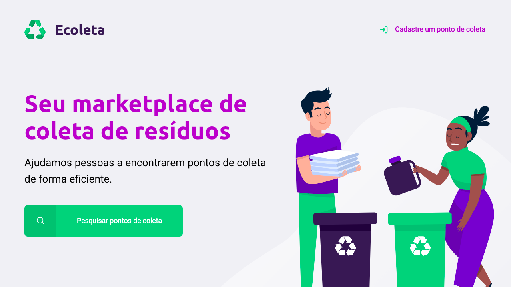
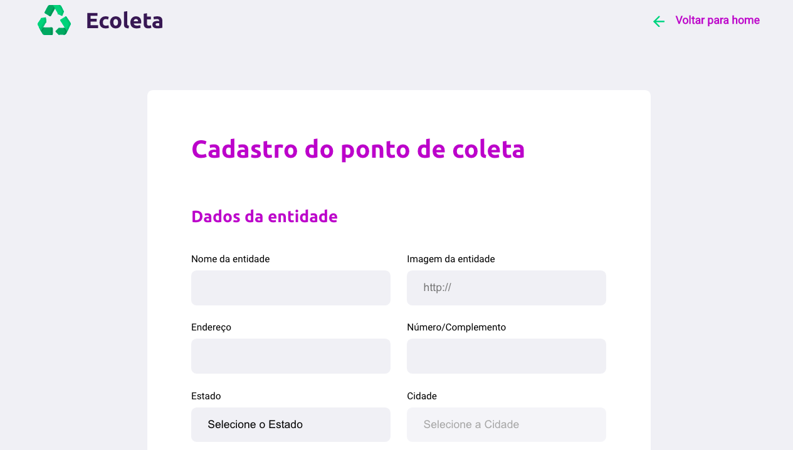
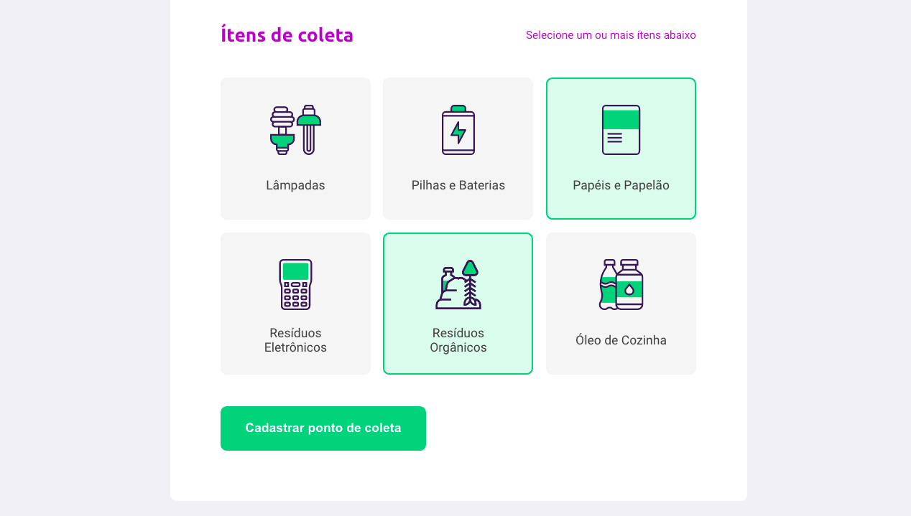
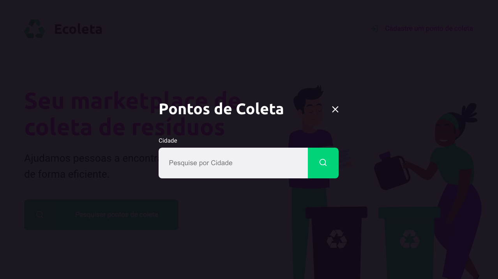
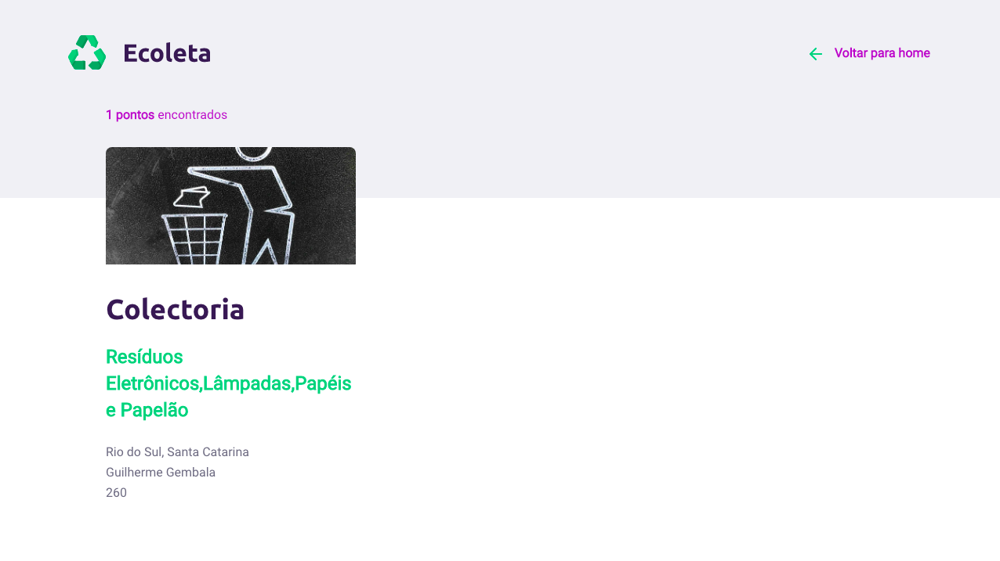

<h1 align="center">
    
</h1>

<h2 align="center">

  
  <br/>
  🚀 Next Level Week  ♻️
</h2>


# Ecoleta

## 📰 Sobre

Projeto criado durante a primeira edição Next Level Week organizado pela Rocketseat que consiste no desenvolvimento de uma aplicação para gerenciamento da coleta de lixo. Trata-se de um site para cadastro e pesquisa de empresas responsáveis por coletar e destinar de forma segura e sustentável, diversos tipo de materiais recicláveis.

## 🛠 Tecnologias Utilizadas


O projeto foi desenvolvido utilizando as seguintes tecnologias:

 - HTML
 - CSS
 - Javascript
 - sqlite3
 - Nunjucks
 
### Pré-requisitos

- [Node](https://nodejs.org/en/)

## ⚙ Instalação

 1. Clone o repositório

```
git clone https://github.com/marcelo5g/next-level-week-1.git
```

2.  instale as dependências

```
npm install
```

3° - Inicie o projeto

```
npm start
```

4° - Abra o projeto na porta 3000

```
http://localhost:3000/
```

## 🎮 Uso

<h3> Página Principal
    
</h3>

<h3>Página de cadastro de empresas:
    
    
</h3>


<h3>Pesquisa por cidade:
    
</h3>

<h3>Resultado da pesquisa por cidade com as empresas cadastradas:
    
</h3>


## 📩 Contatos

Marcelo Martins

Email - **m.martinsx@gmail.com**

Social Medias: 
    
<a href="https://www.linkedin.com/in/marcelo-martins-ribeiro/" target="blank">
    
</a>

<p></p>

Project Link - [Ecoleta](https://github.com/marcelo5g/next-level-week-1)

## ✍ Licença

Distribuído sob a Licença MIT. Ver [LICENSE](https://github.com/marcelo5g/next-level-week-1/blob/master/LICENSE) para maiores informações.

## Issues

If you found any issue, please report in [ISSUES](https://github.com/marcelo5g/next-level-week-1/issues)

